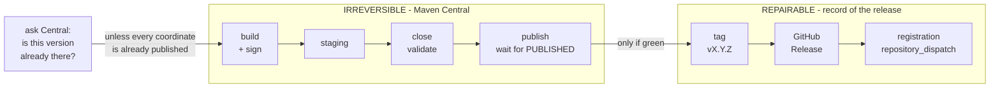
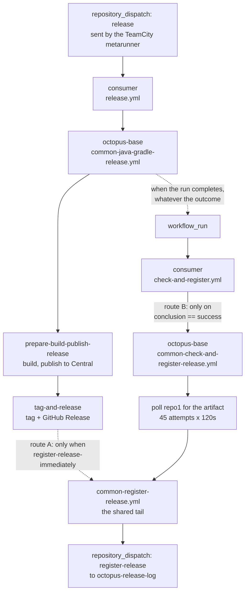
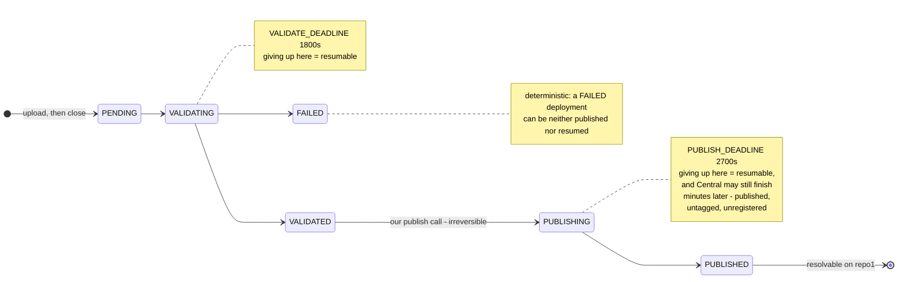
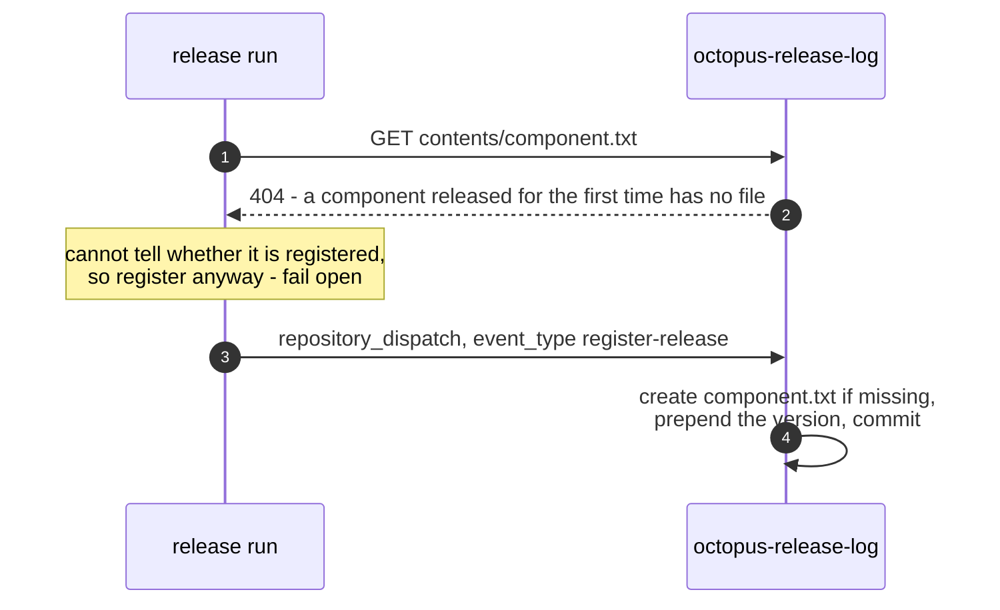

# Octopus Release Pipeline

What runs when a component is released, in what order, what each part guarantees, and what state
a failure leaves behind — for the **shared** pipeline, the `common-*` reusable workflows a consumer
repository calls. Task-oriented recipes live in the
[Developer Guide](Octopus%20Developer%20Guide.md) (what to publish to Maven Central, how to keep a
repository or a module off it, which commit a hybrid release can be cut from) and failure runbooks
in [Administrator Troubleshooting](Octopus%20Administrator%20Troubleshooting.md).

> **Gradle and Maven are not the same pipeline.** Everything below describes
> `common-java-gradle-release.yml` unless stated otherwise. `common-java-maven-release.yml`
> shares the shape but has none of: the Central Portal publish path, the Central preflight, the
> publication guard, a concurrency group, `publish-to-nexus`, `resume-deployment-id`,
> `docker-image`, or `skip-extra-tasks`. Differences are called out as **Maven:** notes.

---

## The short version

If you have never touched this pipeline, this section is the whole thing.

Releasing a component means doing **two** separate things, in two different places:

1. **Put the artifacts on Maven Central**, so other projects can depend on them.
2. **Write down that you did**, so the rest of the org knows: a git tag, a GitHub Release, and a
   line in a shared list called `octopus-release-log`.

The catch is that these two are not one operation, and they behave differently when something
goes wrong. Maven Central has **no undo** — a version that lands there stays there forever, and
the same version can never be uploaded twice. The bookkeeping, by contrast, can be redone as many
times as you like — with one caveat: once a repository turns on GitHub's immutable releases, a
published Release and its tag stop being freely deletable either.



The second half runs **only if the first half finished green**. That one gate causes the failure
this pipeline is known for: if the upload succeeds and the run dies a minute later, the version is
on Central, nothing records it, and the next release computes the same version and is refused —
since #198 before it builds anything, but only when the preflight finds *every* coordinate that
attempt would publish already present; a partial answer warns and lets the build run on to the
close step, as it did before (see [Build, guard, stage, close](#build-guard-stage-close)). Nothing in the
pipeline can repair that on its own.

So when a release goes red, the first question is never "what broke" but **which side of the line
it broke on**. Everything else in this document follows from that; if you only need to know what a
given failure left behind, skip to [Failure shapes](#failure-shapes).

---

## Vocabulary

These words are used precisely throughout. Several of them are routinely confused, and the
confusion is the source of most of the pipeline's surprising behaviour.

**Component**
: One repository that produces one release at a time. Its name is the repository name without
the owner — `octopus-dms-service`, not `octopusden/octopus-dms-service`.
_Avoid_: module, project, artifact.

**Publication**
: One set of Maven coordinates the build publishes — a `MavenPublication` in Gradle terms. One
component can have many; `octopus-external-systems-client` has eleven.
_Avoid_: artifact, module.

**Staging repository**
: A temporary, per-run bucket on Sonatype's OSSRH-compatibility host that receives the upload
before anything is public. Identified by a key like `org.octopusden--831c4beb-…`. Exactly one
per release run; the flow refuses to continue if the build creates more.
_Avoid_: staging area, repo.

**Deployment**
: Sonatype's Central Portal object that the staging repository becomes, identified by a UUID.
This is what has a *deployment state* — `PENDING`, `VALIDATING`, `VALIDATED`, `PUBLISHING`,
`PUBLISHED`, `FAILED`. It belongs to Sonatype, not to us.
_Avoid_: publication, upload.

**Release state**
: Ours, and — unlike a deployment state — not a single value. It is four independent facts in four
systems: the version is on Maven Central; a `vX.Y.Z` tag exists; a GitHub Release exists; a line
exists in the release log. Any combination is reachable, the pipeline cannot always reconcile
them, and a deployment can reach `PUBLISHED` while the release is recorded nowhere.

**Publish classification**
: The pipeline's own verdict on a failed publish — `published`, `deterministic`, `transient`,
`resumable`, `unknown` — emitted as the log marker `RELEASE_PUBLISH_CLASS`. It classifies *our*
options, not Sonatype's state.

**Release log**
: The repository `octopusden/octopus-release-log`. One plain-text file per component, named
`<component>.txt`, holding one version per line, newest first. Downstream bookkeeping reads it.
_Avoid_: registry, release list.

**Registration**
: Adding a version to the release log. It is not a write — it is a `repository_dispatch` event
of type `register-release` sent to that repository, whose own workflow creates the file if it
does not exist and prepends the version.
_Avoid_: logging, recording to the log.

**Flow type**
: `public` — the release computes its own next version from the latest tag and runs the tests.
`hybrid` — the caller supplies both the commit and the version, and tests are skipped.

---

## Entry points

A consumer repository has two workflows that reach this pipeline.

**`release.yml`** — triggered by `repository_dispatch: types: [release]`, normally sent by the
TeamCity metarunner. It calls `common-java-gradle-release.yml` (or the Maven equivalent) pinned
to an `octopus-base` tag.

**`check-and-register.yml`** — triggered by `workflow_run` on the *completed* release workflow.
It calls `common-check-and-register-release.yml`, which polls Maven Central for the artifact and
then registers the release.

Both funnel into `common-register-release.yml`, the shared tail that fires the dispatch.



Route A is off by default. Route B is how most components register, which is why a release that
fails **after** publishing never registers: route B is gated on the release run succeeding.

> `common-check-and-register-release.yml` reads `github.event.workflow_run.*` but declares no
> `workflow_run` trigger of its own. It is silently coupled to being called from a
> `workflow_run`-triggered caller; calling it any other way leaves those fields empty.

---

## Phase A — publish to Maven Central

### Build, guard, stage, close

The job checks out (the default ref for `public`, `commit-hash` for `hybrid`), verifies the
built commit can be tagged **before** building anything, sets up Java, asks Maven Central whether
this version is already published, and only then runs `./gradlew build`.

> **The order matters and is not what the irreversible/reversible split suggests.** For a
> `docker-image` component the image is pushed *before* the publication guard runs, so a guard
> rejection — or any later failure — leaves a pushed image behind that nothing removes. The
> tables below track Central, the tag, the Release and the log; the container registry is a fifth
> piece of state they do not cover. That ordering is #190.

**The Central preflight** stops the release on exactly one verdict: **every** coordinate the
upload would send is already published, which means the close step provably cannot succeed.
Everything else warns and proceeds — a partial overlap, an unanswered repo1, an unlistable
publication set, either ceiling running out, a missing helper. The asymmetry is deliberate: the
check can only ever save a build that was going to fail, so it must never become a new reason a
valid release does not run. It is the exact opposite of the taggability check beside it, which
fails closed.

It is three files, and they fail in different ways — worth knowing, because the way this check
breaks is by quietly doing nothing rather than by going red:

| File | Does |
|---|---|
| `central-preflight-step.sh` | Runs the listing under a **300s** ceiling, passing `-Pnexus=true` and the version properties so the set matches what the real upload sends, then hands the result over. |
| `list-publications.init.gradle` | Produces the coordinates from Gradle's publication model at *configuration* time — no compilation — and filters them to the release version. |
| `central-preflight.sh` | HEADs each coordinate on repo1 within a **90s** budget for the sweep as a whole, and decides. |

The listing is essentially the whole cost: on the canary the repo1 sweep measured **0.09s** and
**0.07s** in two runs, against step totals of 9s and 13s (octopus-test runs 33390083635 and
33393050098, one publication each). Which is why it gets the larger ceiling.

Both ceilings fall open: exceeding either is a warning, never a failure.

> When it does stop, it separates the two situations Sonatype's identical error string conflates.
> It checks two of the four release-state facts — the `v<version>` tag and its GitHub release —
> and nothing else; the release-log entry is the fact it cannot see, which is why the
> release-the-next-version message still tells you to go and check it. Both present: release the
> next version. Either one confirmed missing — a tag whose GitHub release never appeared included
> — that is [#189](https://github.com/octopusden/octopus-base/issues/189), a recovery rather than
> a re-dispatch, so a tag alone routes to the recovery. The state stays unknown — and the
> message says so, listing all three facts to check by hand — when either lookup fails for a
> reason other than a 404, and also when it cannot look at all: no `GITHUB_REPOSITORY`, or no
> `gh` on the runner. In dry-run every stop degrades to a warning.

> Skipped entirely by `publish-to-nexus: false` and by `resume-deployment-id`.

Before the upload, the **publication guard** inspects what would reach Central by publishing to a
throwaway local repository first, and fails on **a publication carrying a version other than
the one being released** — most often Gradle's `unspecified` — or on a shadow/uber artifact, a
Spring Boot executable jar, or anything larger than `max-central-artifact-mb` (default 8). The
version refusal is the one that also fires for a publication with no archive at all, a BOM or a
plugin marker, because the set is enumerated from the generated POMs. See the Developer Guide
for the allowlist and the four remedies.

> The guard runs in dry-run too, deliberately, so a dry run rehearses it. It is skipped by
> `publish-to-nexus: false` **and** by `resume-deployment-id` — a resumed publish is never
> re-inspected.

The upload itself is `./gradlew publishToSonatype closeSonatypeStagingRepository`.

> The Nexus2-compatibility `release` transition — `closeAndReleaseSonatypeStagingRepository` — is
> deliberately **not** used. It leaves the deployment `closed` and nothing ever reaches Maven
> Central. Publication is driven through the Portal API instead, below.

`staging-profile-id` (default `org.octopusden`) is bound to the publishing plugin through an
injected init script. It has two further, undocumented effects: it is the namespace the
coordinate guard checks, and it filters the Portal deployment search (`portal-publish.sh:135`
appends `&profile_id=` only when it is set; blank leaves the search unfiltered, which is benign
because the key-suffix match still pins the deployment). **Leaving it blank disables the namespace half of that guard** — the
version comparison and the "no coordinates at all" check still run, and the script says so with a
`::warning::` annotation rather than failing.

### Publishing through the Central Portal

`.github/scripts/portal-publish.sh` takes over after the upload and runs six phases:

| # | Phase | Poll | Deadline | Default |
|---|---|---|---|---|
| 1 | Locate the Portal deployment for our staging repository | 15 s | `SEARCH_DEADLINE` | 600 s |
| 2 | Wait for `VALIDATED` | 15 s | `VALIDATE_DEADLINE` | 1800 s |
| 3 | Coordinate guard — the deployment must be the one we built | — | — | — |
| 4 | Publish (**irreversible**) | — | max 5 attempts | — |
| 5 | Wait for `PUBLISHED` | 20 s | `PUBLISH_DEADLINE` | 2700 s |
| 6 | Verify every coordinate resolves on repo1 | 30 s | `CENTRAL_DEADLINE` | 1800 s |

All deadlines are environment-overridable, which is how the offline scenario suite runs them in
seconds.

The states being waited on are Sonatype's, not ours. Which wait a run dies in decides how the
failure is classified, and therefore what an operator may do next:



**Phase 3** parses `.purls[]` from the deployment status and refuses to publish if the version
does not match `BUILD_VERSION`, if any group falls outside the staging profile's namespace, or if
there are no Maven coordinates at all. It exists to stop a wrong `resume-deployment-id` from
publishing someone else's work.

**Phase 4** never re-POSTs blindly. An inconclusive response (400/404/409/422) is reconciled
against the deployment state after a settling window, because a late 400 usually means "no longer
`VALIDATED`" — i.e. the publish already went through. Only a deployment still sitting in
`VALIDATED` is treated as a genuine refusal.

> **The deadlines can exceed the outer budget.** Sequentially they permit 6900 s ≈ 115 minutes
> inside this script alone, against a TeamCity poller timeout that was 60 minutes when the
> deadlines were written. In practice the phases after `PUBLISHED` cost seconds, which is why the
> arithmetic has not bitten. `PUBLISH_DEADLINE` is the only deadline set from a measurement —
> one observed 32-minute publish — not from a guess.

### Publish classification

The verdict travels as **log lines**, not step outputs, because reusable-workflow step outputs
are unreliable on failed runs. Anything consuming them scrapes the log.

Three different places emit it, and knowing which one spoke tells you which stage failed:

| Emitter | Covers | Classes it can emit |
|---|---|---|
| `central-preflight.sh` | before the build — the version is already on Central | `deterministic` |
| `portal-publish.sh` | the Portal phases — search, validate, guard, publish, verify | `published`, `deterministic`, `resumable` |
| step *Diagnose & classify Sonatype publish failure* | the Gradle upload/close stage, before the Portal | `deterministic`, `resumable`, `transient`, `unknown` |

Only one of them ever speaks per run. The preflight stops before anything is built, so the other
two are never reached; and between those two, the Portal script drops a marker file when it
classifies and the workflow step stays quiet if that marker is present. `transient` and `unknown` therefore only ever describe a failure *before* the Portal took
over; the script has a `fail_transient` helper but no code path reaches it.

| Class | Retryable | Meaning |
|---|:---:|---|
| `published` | no | Success — everything is `PUBLISHED` and resolvable on repo1. |
| `deterministic` | no | Validation errors, 401/403, a `FAILED` deployment, wrong version or namespace, more than one staging repository. Retrying cannot help. |
| `transient` | **yes** | Unambiguous infrastructure signals (5xx, timeout, connection reset or refused) **before anything was staged**. The only retryable class. |
| `resumable` | no | A staging repository or deployment already exists, so a plain re-run would upload the version a second time. Finish it with `resume-deployment-id` instead. |
| `unknown` | unknown | Nothing matched. There is no evidence a retry will help. |

Companion markers: `RELEASE_PUBLISH_DEPLOYMENT_ID`, `RELEASE_PUBLISH_COMPAT_KEY`, and — for
`resumable` only — `RELEASE_PUBLISH_RESUME_DEPLOYMENT_ID`.

> **A fully successful, irreversible publish can be reported as a failed run.** If artifacts reach
> `PUBLISHED` but are not yet resolvable on repo1 within `CENTRAL_DEADLINE`, the run is classified
> `resumable` and goes red. The same is true when `PUBLISH_DEADLINE` expires while the deployment
> is still `PUBLISHING` — Central may finish minutes later, and the release is then published,
> untagged and unregistered.

### `resume-deployment-id`

The emergency knob for a run that died past the upload. When set, the Gradle upload is skipped
and the named existing deployment is published instead, so the version is not uploaded twice.

**It is unreachable for most consumers as things stand.** It is a `workflow_call` input, and a
caller must expose it in its own `workflow_dispatch` inputs to use it — but consumer `release.yml`
files are `repository_dispatch`-only. Using it today means editing the consumer workflow first.
The Maven flow has no such input at all.

---

## Phase B — record the release

### Tag and GitHub Release

The tag is `v` + the build version. Three things about this job are worth knowing:

**The taggability pre-check runs before the build.** GitHub refuses to point a tag at a commit
carrying a workflow file that exists on no branch head, unless the token may modify workflows —
which the Actions `GITHUB_TOKEN` never may. The release checks this up front and refuses rather
than publishing a version it cannot tag. Under dry-run the check is *weakened* to a warning
rather than skipped, so the dry-run canary cannot catch the case it exists for.

**The tag is waited for before the release is created.** `gh release create --verify-tag`
performs its own lookup through a different read path, and that read can miss a ref committed
milliseconds earlier. `.github/scripts/wait-for-tag-ref.sh` polls the exact GraphQL query
`--verify-tag` uses until the ref is readable. `--verify-tag` is deliberately kept rather than
dropped as redundant: without it, `gh` would create the tag *itself* at the default-branch head —
a stale-code release.

**The release carries a run stamp.** An HTML comment `<!-- octopus-release-run: <run_id>/<attempt> -->`
identifies which run produced it. Registration uses it to resolve the version that was actually
released, rather than whichever tag sorts highest. Two releases do not carry it: one created by the
#189 reconciler, which has no run to name, and `octopus-base`'s own release, whose workflow never
added the stamp. Registration falls back to the highest-sorting tag for those.

### Registration

Two routes reach the release log, and **both can be wired at once**. Both are a
`repository_dispatch`; the file is written by the workflow in `octopus-release-log`, which only
ever prepends. The #189 reconciler is the exception and writes the file directly, because a version
that is not the newest cannot be prepended without breaking the ordering internal post-processing
reads — see [ADR 0005](adr/0005-reconciliation-writes-the-release-log-directly.md).

**Route A — immediate.** `register-release-immediately: true` runs registration inside the release
run, right after the tag. Off by default.

**Route B — after the artifact appears.** `common-check-and-register-release.yml`, triggered by
`workflow_run` on the completed release, polls Maven Central until the artifact is resolvable and
then registers. This is the default route for most components.

> The poll is 45 attempts × 120 s ≈ **90 minutes** before it gives up, and the sleep runs even
> after the final failed attempt. `artifact-pattern` is relative to a hardcoded base,
> `https://repo1.maven.org/maven2/org/octopusden`, with `_VER_` as the version placeholder — the
> group prefix cannot be changed by a consumer.

Both routes end in `common-register-release.yml`, which checks whether the version is already in
the log and, if not, POSTs a `repository_dispatch` to `octopusden/octopus-release-log`. The
receiving workflow there creates the component's file if it does not exist and prepends the
version.

That last point is worth seeing, because it is counter-intuitive: **the file is created by the
receiving side**, so a 404 when reading it is the ordinary first-release case and not an error.



The dispatch is asynchronous and the run does not wait for it. Nothing downstream tells the
release whether the entry landed.

**The duplicate check is an optimisation, not a guarantee, and it is deliberately fail-open.**
Registration is asynchronous, so two callers can both read the log before either dispatch lands;
removing duplicates for good has to happen where the log is written. If the log cannot be read —
a component with no file yet, a rate limit, an unreadable payload — the release is registered
anyway, because a missing entry stalls the pipeline while a duplicate one only repeats
bookkeeping.

> `OCTOPUS_GITHUB_TOKEN` is required for the dispatch but is never declared as a workflow secret.
> It arrives through `secrets: inherit`; dropping that in a consumer breaks registration with no
> signature at the contract level.

---

## Failure shapes

What each kind of failure leaves behind. The columns are the four independent facts that make up
the release state.

| Failure | Central | tag | Release | log | Recoverable by the pipeline? |
|---|:---:|:---:|:---:|:---:|---|
| Guard rejects the upload | — | — | — | — | Nothing left on Central, in git or in the log. But a `docker-image` release has already pushed its image by this point — the push runs before the guard — and nothing cleans that up (#190). Fix and re-dispatch. |
| Portal validation rejects the deployment | — | — | — | — | Yes, but a staging repository and a `FAILED` deployment remain on the Portal side. A `FAILED` deployment can be neither published nor resumed — fix the cause and re-dispatch. |
| Version already on Central | published earlier | varies | varies | varies | Caught by the preflight **before the build**, and the error names which of the two situations it is — or says the recorded state could not be determined. Nothing is built, so this run leaves nothing behind and the earlier release's artifacts are untouched; what varies is whether that release was recorded. If the tag or the GitHub release is missing, run `recover-release.sh` (below). Otherwise release the next version — after checking `octopus-release-log` for the published version, because a tag and a release do not prove it was registered (see *Registration*). |
| `PUBLISH_DEADLINE` expires while `PUBLISHING` | **yes, later** | no | no | no | **No.** Published, unrecorded. |
| Run dies after the upload for any other reason | **yes** | no | no | no | **No.** Same state. |
| Tag created, release creation fails | yes | yes | no | no | Partly — re-run the failed job; it adopts the tag. |
| Registration fails | yes | yes | yes | no | No. `recover-release.sh` writes the entry; it leaves the tag and release alone. |

The rows marked **No** are the same underlying state: the artifacts are permanent, the record is
absent, and the next release computes the same version — which the preflight stops before the
build when it finds every coordinate of that attempt on Central, classified `deterministic`,
rather than letting it die at the close step; if the publication set has changed since, or the
check cannot complete, the build still runs and still dies there. Recovery is manual: create the tag on
the commit that was actually built, create the release, and dispatch the registration. Tracking
issue: octopus-base#189.

---

## What a consumer configures

**Secrets** (`Prod` environment): `OSSRH_USERNAME`, `OSSRH_TOKEN`, `GPG_PRIVATE_KEY`,
`GPG_PASSPHRASE`, `OCTOPUS_GITHUB_TOKEN`. The Sonatype and GPG four are unnecessary when
`publish-to-nexus: false`. **Maven:** they are required whenever `dry-run` is false, regardless.

**Caller workflows**: `release.yml` and `check-and-register.yml`, each a short `uses:` block
pinned to an `octopus-base` tag — never `@main`. The calling job must **not** set `runs-on:`;
`runs-on` and `environment` are set inside the reusable workflow, and setting `environment:` in
the caller adds a second approval gate.

**Pass `secrets: inherit`**, or registration cannot authenticate.

---

## Behaviour that surprises people

- **`docker-image` pushes to a hardcoded owner** — `ghcr.io/octopusden/<image>:<version>` — while
  the login uses the repository's own owner.
- **`publish-to-nexus: false` still produces a tag and a GitHub release.** What it skips is the
  Sonatype publish, its secret check, the Portal helper fetch and its ref resolution, the Central
  preflight, the staging-profile init script, the Portal publish and the publication guard.
  Pair it with `register-release-immediately: true`, or route B waits 90 minutes for an artifact
  that will never appear.
- **The public and hybrid version formats disagree.** `public` enforces strict `X.Y.Z`; `hybrid`
  accepts anything matching `[A-Za-z0-9._+-]+`; **route B's version resolution** then requires
  strict `X.Y.Z`. Registration itself does not — the shared tail accepts any non-blank
  single-line value — so a non-semver hybrid version publishes and tags fine and then fails when
  the artifact-check workflow tries to resolve it, while `register-release-immediately: true`
  puts it in the log without complaint.
- **`increment-version-level` advertises pre-release levels that cannot work** — the version
  parser rejects anything that is not `vX.Y.Z`.
- **`skip-extra-tasks` appends, it does not replace.** In hybrid flow the effective value is
  `-x test -x <extra>`, because hybrid already skips tests.
- **The concurrency key must be extended whenever a caller varies a new input.** It currently
  distinguishes run id, attempt, flow type, docker image and `publish-to-nexus` only. Two dry-run
  variants differing in anything else will cancel each other.
  **Maven:** there is no concurrency group at all, so two overlapping public-flow Maven releases
  can compute and publish the same version.
- **A Maven dry-run compiles and tests nothing** — the only build is inside `mvn deploy`, which
  dry-run skips. The Gradle flow always runs `./gradlew build`.
- **A stranded draft release is finished rather than treated as done.** A draft is invisible to
  the stamp lookup, so leaving one in place would block registration forever. Both flows and the
  reconciler now share `.github/scripts/tag-and-release.sh`, which looks for an existing release
  before it would create one — on every path, including a draft with no tag of its own, which used
  to make the Gradle flow create the tag and then fail with "release already exists". The ref is
  created first and then waited for; publishing a draft is itself a tag-creating operation, so the
  wait covers that too.
- **Registration logic is not separately pinnable.** `common-register-release.yml` is reached
  through a local `uses:` path, so its version is whatever ships in the pinned `octopus-base`
  commit.

## Recovering a published, unrecorded release

The state this fixes: Maven Central holds the version, and one or more of the tag, the GitHub
Release and the `octopus-release-log` entry is missing. The next release computes the same version
and is refused with `already exists`, so the component cannot release again until the record is
completed. Four components have reached it (#189). It is **not** repaired by re-dispatching the
release: Central refuses a coordinate that exists, and a re-dispatch cannot change that.

Run it from an `octopus-base` checkout, ideally on a released tag with a clean worktree. The
script prints its own commit and whether `.github/scripts` has uncommitted changes, so the record
says which version of it ran; it does not refuse a dirty checkout, so read that line:

```bash
.github/scripts/recover-release.sh <owner/repo> <version> <built-sha> <group:artifact>[,...]
# then, once the plan reads right:
.github/scripts/recover-release.sh <owner/repo> <version> <built-sha> <group:artifact>[,...] --apply
```

It plans by default and writes nothing. `--apply` re-reads every fact first.

**The two arguments to get right**, both read out of the failed run's log:

- **`<built-sha>`** — the `Built commit` annotation on that run's page, also in its step summary.
  It is the commit that was *built*, which is usually not the branch head: `octopus-cve-automation`
  2.0.3 was published from a commit two behind `main`. It lives as long as the run does — 90 days,
  the organisation's Actions retention setting, measured from an artifact's `expires_at` because
  the setting itself is not readable through the API. A wedge discovered later than that has no
  record of its built commit, and the operator has to establish it another way. Two annotations must not be used as the
  answer: a **dry run** says `(dry run — nothing published)`, and a **resumed** run says the commit
  belongs to an earlier run and names the Portal deployment it resumed. Neither links to that run —
  find it by that deployment id, and take its own `Built commit` annotation.
- **coordinates** — `group:artifact` pairs, comma-separated. A Gradle release lists them in the
  Central preflight block `Publications this release would publish`, before the build; a resumed
  run has no preflight, so take them from the run that published. A Maven release has no preflight
  at all: its `mvn deploy` output names them in the `Uploading to` lines. `octopus-base`'s own
  release prints a `Deployment coordinates` block. Do not read them out of a `pom.xml`: an
  inherited `groupId` and a multi-module build both make that unreliable
  ([ADR 0007](adr/0007-recovery-coordinates-are-attested-not-derived.md)).

**What it refuses, and why that is the answer:**

| It says | What it means |
|---|---|
| Version not published | None of the coordinates are on Central. This is not #189 — nothing published, so re-run the release. |
| Version only partly published | Some coordinates are there and some are not. Central will not accept the missing ones alongside the ones that exist, so neither recovering nor re-running this version can work. Release the next one. |
| Maven Central did not answer | A 5xx, a rate limit or a dropped connection. Unlike the release preflight, which fails open because it can only ever save a doomed build, this writes tags — so an unanswered question stops it. |
| Tag stands at another commit | The tag exists at a commit other than the one given. Nothing is moved: one of the two is wrong, and a tag pointing at stale code is worse than a missing one. |
| Release log is out of order | The module file's lines are not descending. Repairing that is a separate decision from recording this version; fix the order by hand first. |
| Credential cannot modify workflows | The token lacks `workflow` scope, and GitHub refuses a tag on a commit that touches a workflow file (#180). `gh auth refresh -s workflow`. |

**Warnings it prints and continues past:** adjacent duplicate lines already in the module file
(four real files have them), and a commit that no branch reaches — legitimate when a release branch
was squash-merged and deleted, and never a reason to refuse, because the commit is your attestation
either way.

**The order of the writes matters.** The tag and the release come first, and the release-log entry
only after both are confirmed. That entry is the one thing with a consumer outside these
repositories: internal release post-processing triggers on a commit to `octopus-release-log` and
takes its build number from the first line of `<module>.txt`. When the recovered version lands on
top — it is the newest — that post-processing should run for it, and the script says so; check that
it did. When it is inserted below, post-processing runs and stops at its own "release version is
new" check, which is expected and harmless.

**What it deliberately does not do:** restore the released `pom.xml` asset that the Maven flow
attaches from its build job's artifact. If the component's releases carry one, attach it by hand
straight away, before the release becomes immutable.
