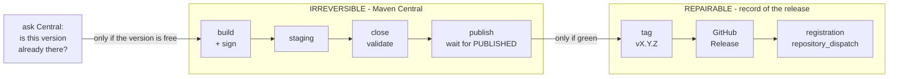
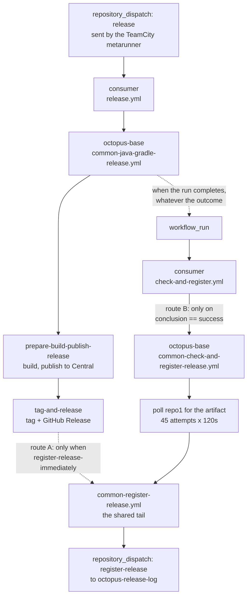
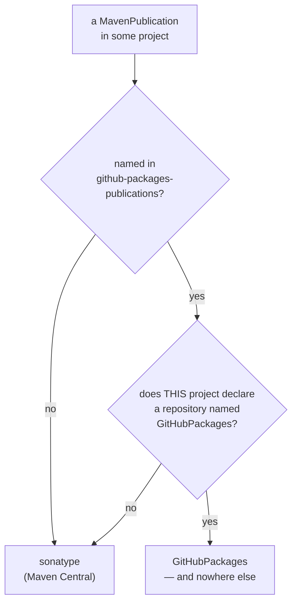
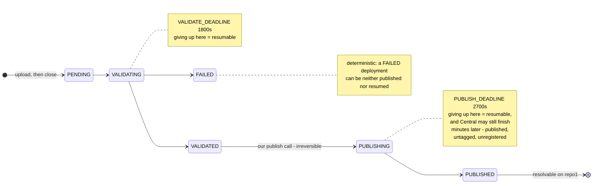
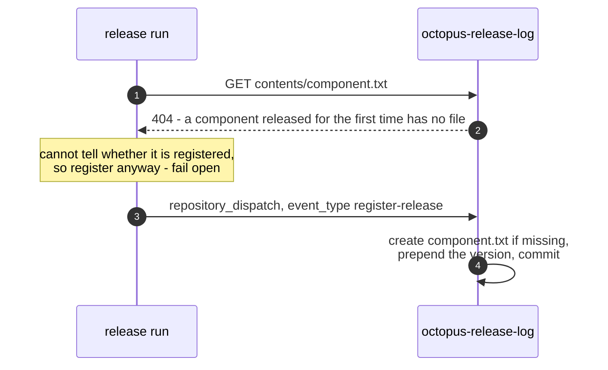

# Octopus Release Pipeline

What runs when a component is released, in what order, what each part guarantees, and what state
a failure leaves behind — for the **shared** pipeline, the `common-*` reusable workflows a consumer
repository calls. Task-oriented recipes live in the
[Developer Guide](Octopus%20Developer%20Guide.md) (what to publish to Maven Central, how to keep a
repository or a module off it, which commit a hybrid release can be cut from) and failure runbooks
in [Administrator Troubleshooting](Octopus%20Administrator%20Troubleshooting.md).

> **Gradle and Maven are not the same pipeline.** Everything below describes
> `common-java-gradle-release.yml` unless stated otherwise. `common-java-maven-release.yml`
> shares the shape but has none of: the Central Portal publish path, the publication guard,
> a concurrency group, `publish-to-nexus`, `resume-deployment-id`, `docker-image`, or
> `skip-extra-tasks`. Differences are called out as **Maven:** notes.

---

## The short version

If you have never touched this pipeline, this section is the whole thing.

Releasing a component means doing **two** separate things, in two different places:

1. **Put the artifacts on Maven Central**, so other projects can depend on them.
2. **Write down that you did**, so the rest of the org knows: a git tag, a GitHub Release, and a
   line in a shared list called `octopus-release-log`.

A publication can be sent to **GitHub Packages instead of Central** — see
[Routing](#routing-which-registry-each-publication-goes-to). It sits between the two halves:
a version cannot be re-published there either, but unlike Central it can be **deleted**, so a
failure there is repairable by hand.

The catch is that these two are not one operation, and they behave differently when something
goes wrong. Maven Central has **no undo** — a version that lands there stays there forever, and
the same version can never be uploaded twice. The bookkeeping, by contrast, can be redone as many
times as you like — with one caveat: once a repository turns on GitHub's immutable releases, a
published Release and its tag stop being freely deletable either.



The second half runs **only if the first half finished green**. That one gate causes the failure
this pipeline is known for: if the upload succeeds and the run dies a minute later, the version is
on Central, nothing records it, and the next release computes the same version and is refused
because it already exists. Nothing in the pipeline can repair that on its own.

So when a release goes red, the first question is never "what broke" but **which side of the line
it broke on**. Everything else in this document follows from that; if you only need to know what a
given failure left behind, skip to [Failure shapes](#failure-shapes).

---

## Vocabulary

These words are used precisely throughout. Several of them are routinely confused, and the
confusion is the source of most of the pipeline's surprising behaviour.

**Component**
: One repository that produces one release at a time. Its name is the repository name without
the owner — `octopus-dms-service`, not `octopusden/octopus-dms-service`.
_Avoid_: module, project, artifact.

**Publication**
: One set of Maven coordinates the build publishes — a `MavenPublication` in Gradle terms. One
component can have many; `octopus-external-systems-client` has eleven.
_Avoid_: artifact, module.

**Staging repository**
: A temporary, per-run bucket on Sonatype's OSSRH-compatibility host that receives the upload
before anything is public. Identified by a key like `org.octopusden--831c4beb-…`. Exactly one
per release run; the flow refuses to continue if the build creates more.
_Avoid_: staging area, repo.

**Deployment**
: Sonatype's Central Portal object that the staging repository becomes, identified by a UUID.
This is what has a *deployment state* — `PENDING`, `VALIDATING`, `VALIDATED`, `PUBLISHING`,
`PUBLISHED`, `FAILED`. It belongs to Sonatype, not to us.
_Avoid_: publication, upload.

**Release state**
: Ours, and — unlike a deployment state — not a single value. It is four independent facts in four
systems: the version is on Maven Central; a `vX.Y.Z` tag exists; a GitHub Release exists; a line
exists in the release log. Any combination is reachable, the pipeline cannot always reconcile
them, and a deployment can reach `PUBLISHED` while the release is recorded nowhere.

**Publish classification**
: The pipeline's own verdict on a failed publish — `published`, `deterministic`, `transient`,
`resumable`, `unknown` — emitted as the log marker `RELEASE_PUBLISH_CLASS`. It classifies *our*
options, not Sonatype's state.

**Release log**
: The repository `octopusden/octopus-release-log`. One plain-text file per component, named
`<component>.txt`, holding one version per line, newest first. Downstream bookkeeping reads it.
_Avoid_: registry, release list.

**Registration**
: Adding a version to the release log. It is not a write — it is a `repository_dispatch` event
of type `register-release` sent to that repository, whose own workflow creates the file if it
does not exist and prepends the version.
_Avoid_: logging, recording to the log.

**Flow type**
: `public` — the release computes its own next version from the latest tag and runs the tests.
`hybrid` — the caller supplies both the commit and the version, and tests are skipped.

---

## Entry points

A consumer repository has two workflows that reach this pipeline.

**`release.yml`** — triggered by `repository_dispatch: types: [release]`, normally sent by the
TeamCity metarunner. It calls `common-java-gradle-release.yml` (or the Maven equivalent) pinned
to an `octopus-base` tag.

**`check-and-register.yml`** — triggered by `workflow_run` on the *completed* release workflow.
It calls `common-check-and-register-release.yml`, which polls Maven Central for the artifact and
then registers the release.

Both funnel into `common-register-release.yml`, the shared tail that fires the dispatch.



Route A is off by default. Route B is how most components register, which is why a release that
fails **after** publishing never registers: route B is gated on the release run succeeding.

> `common-check-and-register-release.yml` reads `github.event.workflow_run.*` but declares no
> `workflow_run` trigger of its own. It is silently coupled to being called from a
> `workflow_run`-triggered caller; calling it any other way leaves those fields empty.

---

## Phase A — publish to Maven Central

### Routing: which registry each publication goes to

By default every Maven publication a build declares goes to Maven Central and nowhere else. A
publication can be sent to **GitHub Packages instead** by naming it in
`github-packages-publications`.

This exists for a **distribution artifact that must remain resolvable by Maven coordinates** — a
shadow jar, a Spring Boot executable jar. Such an artifact is fetched by a build tool rather than
depended on by a project, so it spends Central quota that nothing consumes as a dependency; but it
cannot simply move to a GitHub release asset either, because the tool that fetches it resolves
coordinates, not URLs.

The decision is made **per publication, per project**:



> Before any of that, one build-level check: a name in the input that matches **no** publication in
> **any** project fails the release outright, at configuration time, before anything is published.
> That is the typo guard.

Per project, not per name, because **a publication name is not unique across a multi-project
build**. A repository whose modules all name their publication the same way — a common shape — has
one project with a `GitHubPackages` repository and several without. Matching the name globally
would disable the namesake in every other module, none of which has a GitHub target either,
publishing them nowhere and reporting nothing.

> A publication routed to GitHub Packages is disabled for **every** other target, including
> `publishToMavenLocal`. That last one matters: the publication guard below inspects mavenLocal as
> a proxy for what Central would receive, so a routed publication must not appear there or the
> guard would demand a `fat-jar-publication-allowlist` entry for an artifact Central never sees.

Routing is derived from the input by a generated init script, applied in three places — the guard,
the Sonatype upload, and the GitHub Packages publish. Nothing in a consumer's build script names
publish tasks; a renamed publication therefore cannot silently start publishing to the wrong
registry. Covered by `.github/scripts/test/publication-routing-fixture.sh`.

> `nexusPublishing` binds every publication to the `sonatype` repository, and the upload runs the
> aggregate `publishToSonatype`. That is why the routing has to be applied to the Sonatype step as
> well — without it a routed publication still reaches Central.

### What runs when

| step | runs when |
|---|---|
| Central preflight | `publish-to-nexus` and no `resume-deployment-id` |
| Publication guard | `publish-to-nexus` and no `resume-deployment-id` — **including dry-run** |
| Publish to Sonatype | not dry-run, `publish-to-nexus`, no `resume-deployment-id` |
| Publish via Central Portal | not dry-run and `publish-to-nexus` |
| Publish to GitHub Packages | not dry-run and `github-packages-publications` non-blank |

So `publish-to-nexus: false` with a non-blank `github-packages-publications` makes GitHub Packages
a repository's **only** Maven target.

The GitHub Packages step runs **after** the Central publish has fully succeeded. Not because the
two registries are equally permanent — they are not. Central is genuinely immutable; a GitHub
package version can be deleted, and for a public package that holds until it passes 5,000
downloads, after which it needs GitHub Support. What the order buys is the **failure state we
would rather be in**: Central is the slow one, with a long validating pipeline and many ways to
fail, so putting it first means the common failure happens before anything is written to GitHub
Packages and leaves nothing to clean up. The rarer reverse case — Central green, GitHub Packages
red — leaves a package version that can be deleted and retried.

> Consuming from GitHub Packages needs a token with `read:packages`. That registry has **no
> anonymous read**, even for public packages — unlike `ghcr.io`, which is the same product family
> and does allow anonymous pulls. Publishing needs no PAT: the ambient `GITHUB_TOKEN` suffices.

### Build, guard, stage, close

The job checks out (the default ref for `public`, `commit-hash` for `hybrid`), verifies the
built commit can be tagged **before** building anything, sets up Java, asks Maven Central whether
this version is already published, and only then runs `./gradlew build`.

**The Central preflight** (`.github/scripts/central-preflight.sh`, added in #198) lists the
coordinates the upload would send — from Gradle's publication model at *configuration* time, no
compilation — and HEADs each one on repo1. It stops the release on exactly one verdict: **every**
coordinate is already published, which means the close step provably cannot succeed. Everything
else warns and proceeds — a partial overlap, an unanswered repo1, an unlistable publication set,
an exhausted budget, a missing helper. The asymmetry is deliberate: the check can only ever save a
build that was going to fail, so it must never become a new reason a valid release does not run.
It is the exact opposite of the taggability check beside it, which fails closed.

> When it does stop, it separates the two situations Sonatype's identical error string conflates:
> the previous release published *and* was tagged (release the next version), versus published but
> never recorded (that is [#189](https://github.com/octopusden/octopus-base/issues/189) — a
> recovery, not a re-dispatch). In dry-run every stop degrades to a warning.

> Skipped entirely by `publish-to-nexus: false` and by `resume-deployment-id`.

Before the upload, the **publication guard** inspects what would reach Central by publishing to a
throwaway local repository first, and fails on a shadow/uber artifact, a Spring Boot executable
jar, or anything larger than `max-central-artifact-mb` (default 8). See the Developer Guide for
the allowlist and the four remedies.

> The guard runs in dry-run too, deliberately, so a dry run rehearses it. It is skipped by
> `publish-to-nexus: false` **and** by `resume-deployment-id` — a resumed publish is never
> re-inspected.

The upload itself is `./gradlew publishToSonatype closeSonatypeStagingRepository`.

> The Nexus2-compatibility `release` transition — `closeAndReleaseSonatypeStagingRepository` — is
> deliberately **not** used. It leaves the deployment `closed` and nothing ever reaches Maven
> Central. Publication is driven through the Portal API instead, below.

`staging-profile-id` (default `org.octopusden`) is bound to the publishing plugin through an
injected init script. It has a second, undocumented effect: it is also the namespace the
coordinate guard checks. **Leaving it blank disables the namespace half of that guard** — the
version comparison and the "no coordinates at all" check still run, and the script says so with a
`::warning::` annotation rather than failing.

### Publishing through the Central Portal

`.github/scripts/portal-publish.sh` takes over after the upload and runs six phases:

| # | Phase | Poll | Deadline | Default |
|---|---|---|---|---|
| 1 | Locate the Portal deployment for our staging repository | 15 s | `SEARCH_DEADLINE` | 600 s |
| 2 | Wait for `VALIDATED` | 15 s | `VALIDATE_DEADLINE` | 1800 s |
| 3 | Coordinate guard — the deployment must be the one we built | — | — | — |
| 4 | Publish (**irreversible**) | — | max 5 attempts | — |
| 5 | Wait for `PUBLISHED` | 20 s | `PUBLISH_DEADLINE` | 2700 s |
| 6 | Verify every coordinate resolves on repo1 | 30 s | `CENTRAL_DEADLINE` | 1800 s |

All deadlines are environment-overridable, which is how the offline scenario suite runs them in
seconds.

The states being waited on are Sonatype's, not ours. Which wait a run dies in decides how the
failure is classified, and therefore what an operator may do next:



**Phase 3** parses `.purls[]` from the deployment status and refuses to publish if the version
does not match `BUILD_VERSION`, if any group falls outside the staging profile's namespace, or if
there are no Maven coordinates at all. It exists to stop a wrong `resume-deployment-id` from
publishing someone else's work.

**Phase 4** never re-POSTs blindly. An inconclusive response (400/404/409/422) is reconciled
against the deployment state after a settling window, because a late 400 usually means "no longer
`VALIDATED`" — i.e. the publish already went through. Only a deployment still sitting in
`VALIDATED` is treated as a genuine refusal.

> **The deadlines can exceed the outer budget.** Sequentially they permit 6900 s ≈ 115 minutes
> inside this script alone, against a TeamCity poller timeout that was 60 minutes when the
> deadlines were written. In practice the phases after `PUBLISHED` cost seconds, which is why the
> arithmetic has not bitten. `PUBLISH_DEADLINE` is the only deadline set from a measurement —
> one observed 32-minute publish — not from a guess.

### Publish classification

The verdict travels as **log lines**, not step outputs, because reusable-workflow step outputs
are unreliable on failed runs. Anything consuming them scrapes the log.

Three different places emit it, and knowing which one spoke tells you which stage failed:

| Emitter | Covers | Classes it can emit |
|---|---|---|
| `central-preflight.sh` | before the build — the version is already on Central | `deterministic` |
| `portal-publish.sh` | the Portal phases — search, validate, guard, publish, verify | `published`, `deterministic`, `resumable` |
| step *Diagnose & classify Sonatype publish failure* | the Gradle upload/close stage, before the Portal | `deterministic`, `resumable`, `transient`, `unknown` |

Only one of them ever speaks per run. The preflight stops before anything is built, so the other
two are never reached; and between those two, the Portal script drops a marker file when it
classifies and the workflow step stays quiet if that marker is present. `transient` and `unknown` therefore only ever describe a failure *before* the Portal took
over; the script has a `fail_transient` helper but no code path reaches it.

| Class | Retryable | Meaning |
|---|:---:|---|
| `published` | no | Success — everything is `PUBLISHED` and resolvable on repo1. |
| `deterministic` | no | Validation errors, 401/403, a `FAILED` deployment, wrong version or namespace, more than one staging repository. Retrying cannot help. |
| `transient` | **yes** | Unambiguous infrastructure signals (5xx, timeout, connection reset or refused) **before anything was staged**. The only retryable class. |
| `resumable` | no | A staging repository or deployment already exists, so a plain re-run would upload the version a second time. Finish it with `resume-deployment-id` instead. |
| `unknown` | unknown | Nothing matched. There is no evidence a retry will help. |

Companion markers: `RELEASE_PUBLISH_DEPLOYMENT_ID`, `RELEASE_PUBLISH_COMPAT_KEY`, and — for
`resumable` only — `RELEASE_PUBLISH_RESUME_DEPLOYMENT_ID`.

> **A fully successful, irreversible publish can be reported as a failed run.** If artifacts reach
> `PUBLISHED` but are not yet resolvable on repo1 within `CENTRAL_DEADLINE`, the run is classified
> `resumable` and goes red. The same is true when `PUBLISH_DEADLINE` expires while the deployment
> is still `PUBLISHING` — Central may finish minutes later, and the release is then published,
> untagged and unregistered.

### `resume-deployment-id`

The emergency knob for a run that died past the upload. When set, the Gradle upload is skipped
and the named existing deployment is published instead, so the version is not uploaded twice.

**It is unreachable for most consumers as things stand.** It is a `workflow_call` input, and a
caller must expose it in its own `workflow_dispatch` inputs to use it — but consumer `release.yml`
files are `repository_dispatch`-only. Using it today means editing the consumer workflow first.
The Maven flow has no such input at all.

---

## Phase B — record the release

### Tag and GitHub Release

The tag is `v` + the build version. Three things about this job are worth knowing:

**The taggability pre-check runs before the build.** GitHub refuses to point a tag at a commit
carrying a workflow file that exists on no branch head, unless the token may modify workflows —
which the Actions `GITHUB_TOKEN` never may. The release checks this up front and refuses rather
than publishing a version it cannot tag. Under dry-run the check is *weakened* to a warning
rather than skipped, so the dry-run canary cannot catch the case it exists for.

**The tag is waited for before the release is created.** `gh release create --verify-tag`
performs its own lookup through a different read path, and that read can miss a ref committed
milliseconds earlier. `.github/scripts/wait-for-tag-ref.sh` polls the exact GraphQL query
`--verify-tag` uses until the ref is readable. `--verify-tag` is deliberately kept rather than
dropped as redundant: without it, `gh` would create the tag *itself* at the default-branch head —
a stale-code release.

**The release carries a run stamp.** An HTML comment `<!-- octopus-release-run: <run_id>/<attempt> -->`
identifies which run produced it. Registration uses it to resolve the version that was actually
released, rather than whichever tag sorts highest.

### Registration

Two routes reach the release log, and **both can be wired at once**.

**Route A — immediate.** `register-release-immediately: true` runs registration inside the release
run, right after the tag. Off by default.

**Route B — after the artifact appears.** `common-check-and-register-release.yml`, triggered by
`workflow_run` on the completed release, polls Maven Central until the artifact is resolvable and
then registers. This is the default route for most components.

> The poll is 45 attempts × 120 s ≈ **90 minutes** before it gives up, and the sleep runs even
> after the final failed attempt. `artifact-pattern` is relative to a hardcoded base,
> `https://repo1.maven.org/maven2/org/octopusden`, with `_VER_` as the version placeholder — the
> group prefix cannot be changed by a consumer.

Both routes end in `common-register-release.yml`, which checks whether the version is already in
the log and, if not, POSTs a `repository_dispatch` to `octopusden/octopus-release-log`. The
receiving workflow there creates the component's file if it does not exist and prepends the
version.

That last point is worth seeing, because it is counter-intuitive: **the file is created by the
receiving side**, so a 404 when reading it is the ordinary first-release case and not an error.



The dispatch is asynchronous and the run does not wait for it. Nothing downstream tells the
release whether the entry landed.

**The duplicate check is an optimisation, not a guarantee, and it is deliberately fail-open.**
Registration is asynchronous, so two callers can both read the log before either dispatch lands;
removing duplicates for good has to happen where the log is written. If the log cannot be read —
a component with no file yet, a rate limit, an unreadable payload — the release is registered
anyway, because a missing entry stalls the pipeline while a duplicate one only repeats
bookkeeping.

> `OCTOPUS_GITHUB_TOKEN` is required for the dispatch but is never declared as a workflow secret.
> It arrives through `secrets: inherit`; dropping that in a consumer breaks registration with no
> signature at the contract level.

---

## Failure shapes

What each kind of failure leaves behind. The columns are the four independent facts that make up
the release state. A fifth destination exists when a publication is routed — see the GitHub
Packages rows at the end.

| Failure | Central | tag | Release | log | Recoverable by the pipeline? |
|---|:---:|:---:|:---:|:---:|---|
| Guard rejects the upload | — | — | — | — | Yes — nothing left anywhere. Fix and re-dispatch. |
| Portal validation rejects the deployment | — | — | — | — | Yes, but a staging repository and a `FAILED` deployment remain on the Portal side. A `FAILED` deployment can be neither published nor resumed — fix the cause and re-dispatch. |
| Version already on Central | published earlier | — | — | — | Caught by the preflight **before the build**, and the error names which of the two situations it is — or says the recorded state could not be determined. The earlier release is intact. Release the next version — or, if the tag or release is missing, run the #189 recovery. |
| `PUBLISH_DEADLINE` expires while `PUBLISHING` | **yes, later** | no | no | no | **No.** Published, unrecorded. |
| Run dies after the upload for any other reason | **yes** | no | no | no | **No.** Same state. |
| Tag created, release creation fails | yes | yes | no | no | Partly — re-run the failed job; it adopts the tag. |
| Registration fails | yes | yes | yes | no | No. The entry must be added by hand. |
| **GitHub Packages publish fails** after Central succeeded | yes | no | no | no | No, and the state is the one above *plus* an absent package. Recover the release by hand; the version can then be published to GitHub Packages only by re-running that step, since the version cannot be re-published there either. |
| Run dies **after** the GitHub Packages publish | yes | no | no | no | No. Central and the package are both permanent-as-published; **delete the package version before retrying**, or the retry fails on a version that already exists. |

The rows marked **No** are the same underlying state: the artifacts are permanent, the record is
absent, and the next release computes the same version and dies on `already exists` — which the
classifier correctly calls `deterministic`, because it is. Recovery is manual: create the tag on
the commit that was actually built, create the release, and dispatch the registration. Tracking
issue: octopus-base#189.

A routed publication adds one repairable step to that recovery. A GitHub package version **can**
be deleted — for a public package until it passes 5,000 downloads, after which it needs GitHub
Support — so a half-finished release that left a package behind is cleaned up by deleting that
version before retrying. Central offers no equivalent.

---

## What a consumer configures

**Secrets** (`Prod` environment): `OSSRH_USERNAME`, `OSSRH_TOKEN`, `GPG_PRIVATE_KEY`,
`GPG_PASSPHRASE`, `OCTOPUS_GITHUB_TOKEN`. The Sonatype and GPG four are unnecessary when
`publish-to-nexus: false`. **Maven:** they are required whenever `dry-run` is false, regardless.

**Caller workflows**: `release.yml` and `check-and-register.yml`, each a short `uses:` block
pinned to an `octopus-base` tag — never `@main`. The calling job must **not** set `runs-on:`;
`runs-on` and `environment` are set inside the reusable workflow, and setting `environment:` in
the caller adds a second approval gate.

**Pass `secrets: inherit`**, or registration cannot authenticate.

**`github-packages-publications`** (optional): Gradle publication names to send to GitHub Packages
instead of Central. Requires a publishing repository named `GitHubPackages` in the build script.
Publishing needs no extra secret — it uses the run's own `GITHUB_TOKEN` — but consumers of the
resulting package need a token with `read:packages`.

**Permissions**, when using that input. A reusable workflow can only *narrow* the permissions its
caller grants; it can never widen them. State them on the calling job:

```yaml
jobs:
  release:
    permissions:
      contents: write   # tag and GitHub Release
      packages: write   # publish to GitHub Packages
    uses: octopusden/octopus-base/.github/workflows/common-java-gradle-release.yml@vX.Y.Z
```

> Nothing is blocked in this organisation today: the default token evidently already grants package
> write, which is what lets the existing GHCR push work. It is stated because the failure is
> invisible until it happens — tightening that default, or adopting the input in an organisation
> whose default is read-only, breaks publication with an error that names permissions nowhere.

---

## Behaviour that surprises people

- **`docker-image` pushes to a hardcoded owner** — `ghcr.io/octopusden/<image>:<version>` — while
  the login uses the repository's own owner.
- **`publish-to-nexus: false` still produces a tag and a GitHub release.** What it skips is the
  Sonatype publish, its secret check, the Portal helper fetch and the fat-jar publication guard.
  Pair it with `register-release-immediately: true`, or route B waits 90 minutes for an artifact
  that will never appear.
- **The public and hybrid version formats disagree.** `public` enforces strict `X.Y.Z`; `hybrid`
  accepts anything matching `[A-Za-z0-9._+-]+`; registration then requires strict `X.Y.Z`. A
  non-semver hybrid version publishes and tags fine and fails only at registration.
- **`increment-version-level` advertises pre-release levels that cannot work** — the version
  parser rejects anything that is not `vX.Y.Z`.
- **`skip-extra-tasks` appends, it does not replace.** In hybrid flow the effective value is
  `-x test -x <extra>`, because hybrid already skips tests.
- **The concurrency key must be extended whenever a caller varies a new input.** It currently
  distinguishes run id, attempt, flow type, docker image, `publish-to-nexus` and
  `github-packages-publications`. Two dry-run variants differing in anything else will cancel each
  other — GitHub keeps only one pending run per group.
  **Maven:** there is no concurrency group at all, so two overlapping public-flow Maven releases
  can compute and publish the same version.
- **A Maven dry-run compiles and tests nothing** — the only build is inside `mvn deploy`, which
  dry-run skips. The Gradle flow always runs `./gradlew build`.
- **A stranded draft release is finished rather than treated as done — but only on one of the two
  Gradle paths.** A draft is invisible to the stamp lookup, so leaving one in place blocks
  registration forever. The Gradle flow publishes a draft it finds when the tag *and* a release
  both already exist; it does nothing about the more likely shape, a draft with no tag (GitHub
  does not create the tag until a draft is published). On that path the tag gets created and
  `gh release create` then fails with "release already exists".
  **Maven:** every path publishes the draft — creation always ends `--draft=false`, and the
  existing-release path calls `publish_if_draft`.
- **Registration logic is not separately pinnable.** `common-register-release.yml` is reached
  through a local `uses:` path, so its version is whatever ships in the pinned `octopus-base`
  commit.
